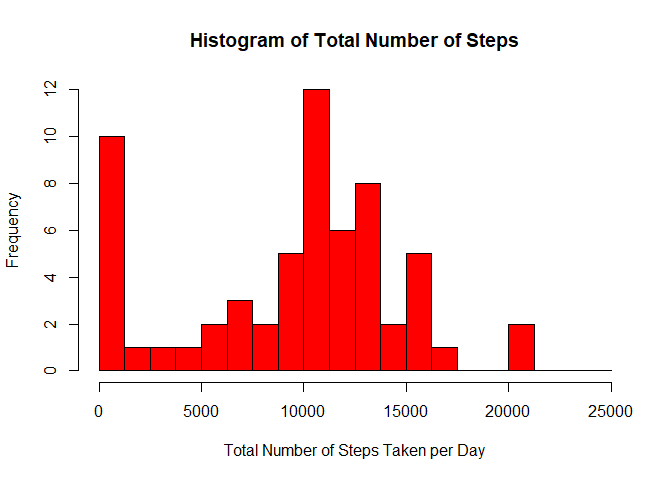
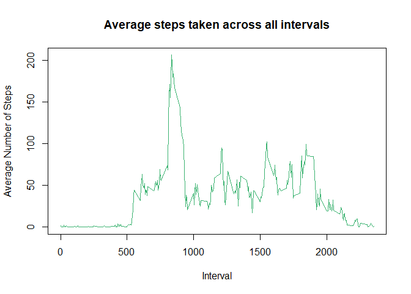
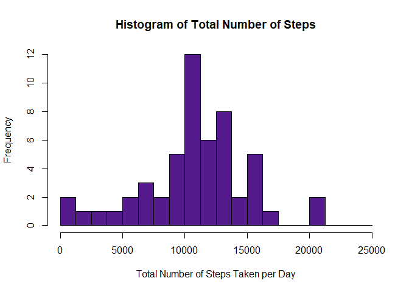
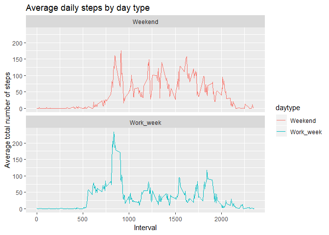

## Loading and preprocessing the data
The data has been downloaded and unzipped into my working directory.  
Below I will:  
  
1. Set my working directory
2. Install ggplot2 library
2. Read in the csv of the data 
3. Explore the data
4. Make sure that the date field is formatted in a way that R can deal with. (R knows it is a date.)
5. List the weekday associated with each date
6. Print a summary of the data


```r
# set wd
setwd('C:/Users/aclarke5/OneDrive - KPMG/Documents/R Working Directory')

# ggplot
library(ggplot2)

#read in file 
activity <- read.csv('activity.csv')

# explore
head(activity)
```

```
##   steps       date interval
## 1    NA 2012-10-01        0
## 2    NA 2012-10-01        5
## 3    NA 2012-10-01       10
## 4    NA 2012-10-01       15
## 5    NA 2012-10-01       20
## 6    NA 2012-10-01       25
```

```r
# confirm date is in useable format
activity$date <- as.Date(activity$date)

# weekdays
weekday <- weekdays(activity$date)
activity <- cbind(activity, weekday)
summary(activity)
```

```
##      steps             date               interval           weekday    
##  Min.   :  0.00   Min.   :2012-10-01   Min.   :   0.0   Friday   :2592  
##  1st Qu.:  0.00   1st Qu.:2012-10-16   1st Qu.: 588.8   Monday   :2592  
##  Median :  0.00   Median :2012-10-31   Median :1177.5   Saturday :2304  
##  Mean   : 37.38   Mean   :2012-10-31   Mean   :1177.5   Sunday   :2304  
##  3rd Qu.: 12.00   3rd Qu.:2012-11-15   3rd Qu.:1766.2   Thursday :2592  
##  Max.   :806.00   Max.   :2012-11-30   Max.   :2355.0   Tuesday  :2592  
##  NA's   :2304                                           Wednesday:2592
```

## What is mean total number of steps taken per day?
For this part of the assignment, we will ignore the missing values in the dataset.  
  
1. Calculate the total number of steps taken per day
2. Make a histogram of the total number of steps taken each day
3. Calculate and report the mean and median of the total number of steps taken per day
  
#### Histogram of total number of steps per day


```r
total_steps <- with(activity, aggregate (steps, by=list(date), FUN=sum, na.rm=TRUE))
names(total_steps) <- c("date", "number_steps")
hist(total_steps$number_steps, main="Histogram of Total Number of Steps", xlab="Total Number of Steps Taken per Day", col="red", breaks = seq(0,25000, by=1250))
```

<!-- -->

#### Calculating Mean

```r
mean(total_steps$number_steps)
```

```
## [1] 9354.23
```

#### Calculating Median

```r
median(total_steps$number_steps)
```

```
## [1] 10395
```


## What is the average daily activity pattern?
1. Make a time series plot of the 5-minute interval (x-axis) and the average number of steps taken, averaged across all days (y-axis)
2. Which 5-minute interval, on average across all the days in the dataset, contains the maximum number of steps?

#### Time series plot of average number of steps

```r
average_activity <- aggregate(activity$steps, by=list(activity$interval), FUN=mean, na.rm=TRUE)
names(average_activity) <- c("interval", "mean_activity")
plot(average_activity$interval, average_activity$mean_activity, type="l", col='mediumseagreen', main='Average steps taken across all intervals', xlab='Interval', ylab='Average Number of Steps')
```

<!-- -->

#### Find the interval with the maximum number of steps

```r
average_activity[which.max(average_activity$mean_activity), ]$interval
```

```
## [1] 835
```
## Imputing missing values
There are a number of days/intervals where there are missing values (coded NA). The presence of missing days may introduce bias into some calculations or summaries of the data.  
  
1. Calculate and report the total number of missing values in the dataset (i.e. the total number of rows with NAs)
2. Devise a strategy for filling in all of the missing values in the dataset. The strategy does not need to be sophisticated. For example, you could use the mean/median for that day, or the mean for that 5-minute interval, etc.
3. Create a new dataset that is equal to the original dataset but with the missing data filled in.
4. Make a histogram of the total number of steps taken each day and Calculate and report the mean and median total number of steps taken per day. Do these values differ from the estimates from the first part of the assignment? What is the impact of imputing missing data on the estimates of the total daily number of steps?

#### Calculate total number of NAs

```r
sum(is.na(activity$steps))
```

```
## [1] 2304
```

#### Create data to input for missing values

```r
to_fill_in <- average_activity$mean[match(activity$interal, average_activity$interval)]
```

#### Fill in missing values with these

```r
activity_fill_in <- transform(activity, steps=ifelse(is.na(activity$steps), yes=to_fill_in, no=activity$steps))
total_steps_filled <- aggregate(steps~date, activity_fill_in, sum)
names(total_steps_filled) <- c("date", "total_steps_taken")
```

##### Histogram 

```r
hist(total_steps_filled$total_steps_taken, main="Histogram of Total Number of Steps", xlab="Total Number of Steps Taken per Day", col="purple4", breaks = seq(0,25000, by=1250))
```

<!-- -->

## Are there differences in activity patterns between weekdays and weekends?

1. Create a new factor variable in the dataset with two levels - "weekday" and "weekend" indicating whether a given date is a weekday or weekend day.
2. Make a panel plot containing a time series plot of the 5-minute interval (x-axis) and the average number of steps taken, averaged across all weekday days or weekend days (y-axis). 


```r
activity$daytype <- sapply(activity$weekday, function(x){
        if (x=="Saturday" | x=="Sunday")
                {y <- "Weekend"} else
                {y <- "Work_week"}
                y
        })

activity_by_daytype <- aggregate(steps~interval + daytype, activity, mean, na.rm=TRUE)
plot <- ggplot(activity_by_daytype, aes(x=interval, y=steps, color=daytype)) + 
        geom_line() +
        labs(title = "Average daily steps by day type", x = "Interval", y = "Average total number of steps") +
       facet_wrap(~daytype, ncol = 1, nrow=2)
print(plot)
```

<!-- -->

© 2019 GitHub, Inc.
